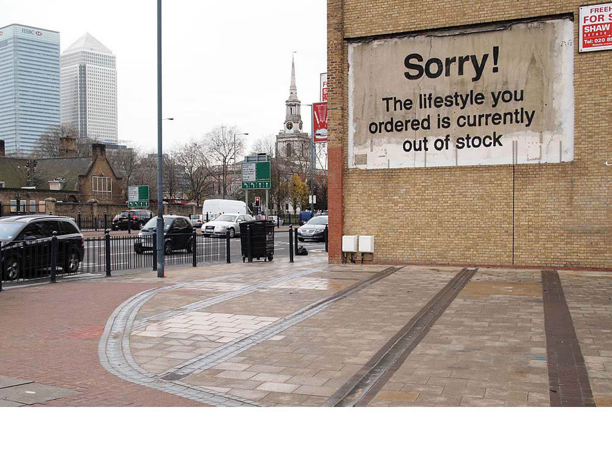

```{r setup, include = FALSE, echo = FALSE}

libs <- c("dplyr", "ggplot2", "tidyr", "plotly", "lubridate")
lapply(libs, library, character.only = TRUE)
programs <- list.files("R/", full.names = TRUE)
lapply(programs, source)

date_start <- as.Date(params$date_min, format = "%Y%m%d")
date_end <- as.Date(params$date_max, format = "%Y%m%d")

update_date <- format(Sys.Date(), "%B %d, %Y")

fred_api_key <- Sys.getenv("FRED_API_KEY")

```

## For the Young & Young at Heart {#welcome}

This blog began as a phone call, then got sent as emails, followed by more emails.\
As of now, it's a collection of career frameworks I've shared often enough to build a home for them.\
The advice, to the extent it's valuable, is usually a product of [me] learning the hard way. 

As with all advice, your mileage may vary. Take it with a grain of salt. 

## Why "Letters"? {#whyletters}

> **Pipelines matter.**

{#fig-id width=50% fig-align="center"}

Human capital--our abilities, what we're capable of with our skills, training, and creativity--is
the most precious resource in any economy. It's hard-won and too easily lost to a
grueling labor market, where long periods of under- or unemployment weigh on
new analysts' aspirations. Since 2008, early career folks have been scarred by generation-defining stretches of
high [youth unemployment](https://fred.stlouisfed.org/series/LNS14024887). 

```{r youth_unemployment, echo = FALSE, warning = FALSE, message = FALSE}

youth_series <- "LNS14024887"
youth_series_title = "Unemployment Rate, Age 16-24"

youth_data <- pull_fred_series(api_key = fred_api_key,
                               series_ids = youth_series) %>%
  pivot_wider(names_from = "series", values_from = "obs") %>%
  arrange(obs_date) %>%
  rename(date = obs_date)

data_updated <- format(max(unique(youth_data$updated_at)), "%B %d, %Y")

plotly_line_interactive(df = youth_data,
                        series_id = youth_series,
                        series_label = youth_series_title,
                        source = "Source: U.S. Bureau of Labor Statistics via FRED",
                        date_start = params$date_min,
                        date_end = params$date_max)

```

> **As we face continuing labor market uncertainty, we can do better.**

We can do better by the generation of analysts rising behind us. It's each
generation's responsibility to throw a rope ladder out to the next generation,
to help them up the first rungs. No one does this alone, and early career folks 
may not know where to start. 

We can also do better by mid-career analysts seeking to level up, curious about new tools
but too shy or proud to ask their colleagues. The labor market's always
evolving, a kaleidoscope dance floor we trip to keep pace with, a path of laser
fields we navigate haphazardly. Continuing education in most fields is neither easy nor obvious.

This blog is for both analysts. For folks starting & re-starting.

We can never predict what our lives will look like, and our decisions are always half
chance, made with whatever imperfect information available to us at the time. Despite this,
we can create processes to better understand, track, and further our own development, and we can
increase our awareness of the types of work and skill-sets in use around us. Growth
is easier as a team sport. It's a virtuous cycle.

If this is helpful to you, pay it forward. The next generation needs you.

To your future development! ✨🥂 ✨ 

## Credits & Disclaimers {#lettersanddisc}

Views my own and do not reflect the views of any current or prior employer.  
I receive no compensation for this blog or any recommended resources in it. 

Blog based on [openscapes](https://openscapes.github.io/quarto-website-tutorial/). Thank you. ❤️  
Formatting in css assisted by Claude Code; no other AI was used in blog creation.

Side image cred: [Rain Drops](https://www.pexels.com/photo/rain-drops-459451/), taken August 15, 2015, uploaded July 5, 2017.\
Page image cred: [Banksy, Sorry The Lifestyle You Ordered Is Currently Out of Stock, London, 2011](https://banksyexplained.com/banksy-murals-per-year/)

The name: a play on [Rainer Maria Rilke](https://poets.org/poet/rainer-maria-rilke)'s[^1] 
[_Letters to a Young Poet_](https://en.wikipedia.org/wiki/Letters_to_a_Young_Poet),[^2]
with apologies to Rilke. 


[^1]: poets.org, "Rainer Maria Rilke," <https://poets.org/poet/rainer-maria-rilke>.  
[^2]: _Wikipedia_, "Letters to a Young Poet," <https://en.wikipedia.org/wiki/Letters_to_a_Young_Poet>.
